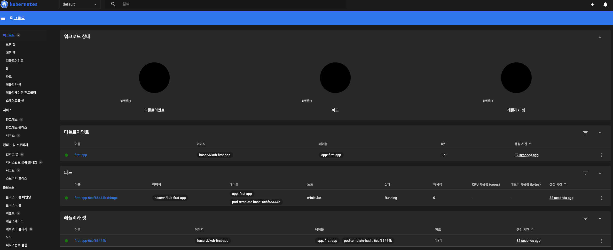
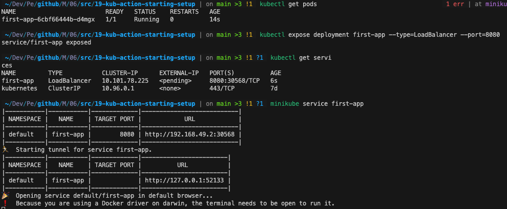

# 19-kub-action-starting-setup

image build

``` bash
docker build -t kub-first-app . 
```

이미지를 쿠버네티스 클러스터로 보내야 함

minikube 동작 확인 및 정지 시 실행(mac 기준)

``` bash
minikube status
minikube start --driver=docker
```

대시보드 실행

``` bash
minikube dashboard
```

## --type 유형에 대해

ClusterIP: 기본값으로, 내부 클러스터 IP 주소를 할당하여 서비스에 접근할 수 있게 한다. 이 유형은 클러스터 내부에서만 접근 가능하며, 외부로 노출되지 않는다

NodePort: 서비스를 클러스터 내부 IP 주소와 함께 노드의 특정 포트로 노출하며, 노드의 IP 주소와 노출된 포트를 조합하여 액세스할 수 있다.

LoadBalancer: 클라우드 프로바이더의 로드 밸런서를 사용하여 서비스를 외부로 노출한다. 로드 밸런서는 서비스에 대한 외부 IP 주소를 할당하고 트래픽을 서비스의 백엔드 파드로 분산시킬 수 있다. 이 유형은 클라우드 프로바이더에서 로드 밸런서를 지원하는 경우에만 사용할 수 있습니다.

``` bash
docker build -t kub-first-app # docker 이미지 생성
docker run -d --rm --name first-app -p 8080:8080 kub-first-app # docker 컨테이너 생성

kubectl create deployment first-app --image=kub-first-app
Kubectl delete deployment first-app # 삭제

# docker 허브에 이미지 등록
docker tag kub-first-app haservi/kub-first-app
docker push haservi/kub-first-app
kubectl create deployment first-app --image=haservi/kub-first-app # 도커 허브에서 이미지 받아옴


kubectl get deployments # 배포 상태 확인
kubectl get pods # 이미지 상태 확인
kubectl expose deployment first-app --type=LoadBalancer --port=8080
kubectl get services # 서비스가 실행됐는지 확인

minikube service first-app # 쿠버네티스에 의해 생성한 pod 실행
```




