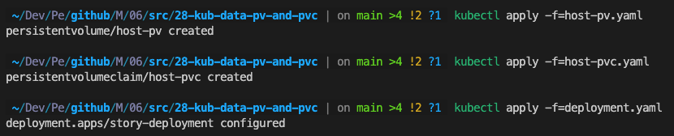

# 28-kub-data-pv-and-pvc

``` bash
kubectl get sc # 스토리지 클래스 정보 확인
kubectl get pv # 영구 볼륨 리스트 확인
kubectl get pvc # 영구 볼륨 클레임 리스트 확인

kubectl apply -f=host-pv.yaml # persistent volume 적용
kubectl apply -f=host-pvc.yaml # persistent volume claim 적용
kubectl apply -f=deployment.yaml
```



`kubectl api-resources`를 입력하면 kubectl의 명령어를 어느 정도 확인 할 수 있다.
