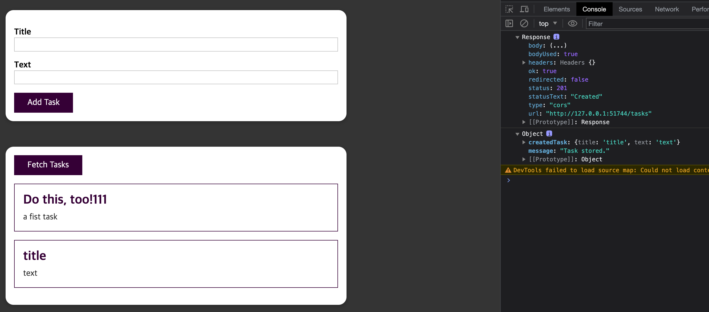

# 35-kub-network-added-frontend

``` bash
docker build -t haservi/kub-demo-tasks .
docker push haservi/kub-demo-tasks

docker build -t haservi/kub-demo-frontend .
docker push haservi/kub-demo-frontend
```

``` bash
kubectl delete -f=tasks-service.yaml -f=tasks-deployment.yaml
kubectl apply -f=tasks-service.yaml -f=tasks-deployment.yaml
minikube service tasks-service

kubectl delete -f=frontend-service.yaml -f=frontend-deployment.yaml
kubectl apply -f=frontend-service.yaml -f=frontend-deployment.yaml
minikube service frontend-service
```

전체적으로 테스트 하기가 조금 불편한 느낌.. 리버시 프록시를 쓰면 조금 더 나아질려나??  

1. task 도커 허브에 올리고, task k8s를 만든 후 minikube service
2. task url front에 넣고 front 도커 허브 올리고, front k8s 실행


