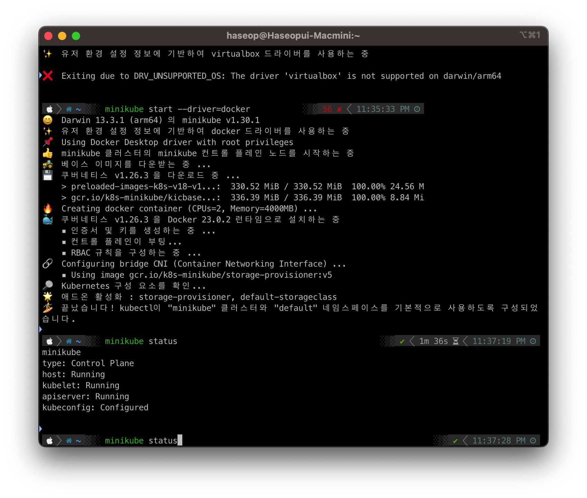

# udemy-docker-kubernetes

해당 저장소는 Udemy Docker Kubernetes [강의](https://www.udemy.com/course/docker-kubernetes-2022/)를 학습한 코드입니다.

학습 시작일: 2023년 1월 15일  
학습 종료일: 2023년 7월 5일

K8S를 실제 AWS EKS를 실습하고 싶은 점도 있었지만 기본적으로 minikube에서도 충분히  
필요한 정보를 얻을 수 있었다.

docker와 docker-compose만 잘 이용해도 실무에서 잘 쓸 수 있다고 생각된다. 😅

## Docker Compose

도커 컴포즈 실행

- -d: detached 모드
- up --build: 이미지를 리빌드

``` bash
docker-compose up -d
```

도커 컴포즈 종료

- -v: 볼륨과 함께 제거

``` bash
docker-compose down -v
```

## 도커 명령어 관련 정보

- `-p` 포트 설정 ex) 3000:80 -> host port:container port
- `-d` `detached mode로 도커 컨테이너를 백그라운드에서 실행
- `--name` 컨테이너 이름 지정
- `--rm` 피드백이 중지 시 자동으로 컨테이너 제거
- `-v` 볼륨 지정 명명된 볼륨은 컨테이너가 제거하지 않음
- `:ro` 읽기 전용

도커 내부에서 나의 로컬 호스트를 아는 방법

``` bash
localhost:port -> host.docker.internal:port
```

도커 컨테이너 및 이미지 한번에 제거

``` bash
docker container prune
docker image prune # 이게 안되면 아래거로
docker rmi $(docker images -a -q)
docker volume prune
```

### 바인드 마운트 단축키

``` bash
macOS/Linux: -v $(pwd):/app
Windows: -v "%cd%":/app
```

### AWS에 대해

AWS는 Amazon Web Services의 약어로, 아마존닷컴이 제공하는 클라우드 컴퓨팅 서비스 플랫폼입니다. AWS는 컴퓨팅, 스토리지, 데이터베이스, 분석, 인공지능, IoT 및 기타 다양한 서비스를 제공하여 기업이나 개인이 필요로 하는 IT 인프라를 클라우드 기반으로 구축하고 관리할 수 있도록 도와줍니다. 아래 링크는 AWS에 대한 강사분의 영상 설명 링크입니다.  
[AWS에 대한 유튜브 영상 링크](https://academind.com/tutorials/aws-the-basics)

### 도커 이미지 공식홈페이지 등록/업데이트/가져오기

도커 이미지 등록

``` bash
docker login # 로그인
docker build -t node-dep-example . # 이미지 생성
docker tag node-dep-example haservi/node-dep-example # 태그 지정
docker push haservi/node-dep-example # 푸시
```

도커 이미지 업데이트 방법

``` bash
docker build -t node-dep-example . # 동일한 태그로 등록
docker tag node-dep-example haservi/node-dep-example:0.1 # 버전 명시
docker push haservi/node-dep-example:0.1 # 푸시
```

도커 이미지 가져오기

``` bash
docker pull haservi/node-dep-example:0.1
```

팁으로 도커 이미지의 변화없이 같으면 이미지의 이름은 다르지만 이미지ID가 같아서 삭제가 안되는 경우가 있다.
이럴 때는 아래와 같이 태그를 명시해서 제거할 수 있다.

``` bash
docker rmi [이미지이름:tag]
```

### docker.prod 설정 관련

Docker CMD에서 `CMD [ "npm", "start" ]`값은 기본적으로 package.json의 스크립트에 있는 start 명령어를 실행한다.  
이외에는 가운데에 `CMD [ "npm", "run", "start" ]`을 추가해서 스크립트 실행해야한다.

[nginx docker menual](https://hub.docker.com/_/nginx)을 참조하여 빌드된 파일의 위치를 지정해야 한다.

멀티스테이지 빌드로 하나의 도커파일에 여러 이미지를 빌드할 수 있다.

-f: 도커 파일명을 지정할 수 있음

``` bash
docker build -f frontend/Dockerfile.prod ./frontend
```

-------------------------------------------------------------------------------

## 03-python-app-starting-setup

간단한 유틸리티 실행

``` bash
# 도커 빌드
docker build .
# 이미지 실행
docker run -it [이미지ID]
# 컨테이너 실행
docker start -a -i [컨테이너ID]
```

-it 옵션은 -i와 -t 옵션을 합쳐놓은 것이다.  
-i 옵션은 컨테이너에서 입력을 받을 수 있도록 해주며, -t 옵션은 터미널 입출력을 사용할 수 있다.
-a 옵션은 터미널 입출력이 가능하도록 해준다.

따라서 -it 옵션은 컨테이너에서 입력과 터미널 입출력을 사용할 수 있도록 해준다.  
-a -i 옵션은 터미널 입출력을 사용할 수 있도록 하고, 컨테이너에서 출력문에 대한 연결을 할 수 있도록 해준다.

## 04-data-volumes-starting-setup

도커 파일 생성 후 아래와 같이 명령어 실행

### 이미지 생성

- `-t`는 태그를 달기 위한 명령어

``` bash
docker build -t feedback-node .
```

### 컨테이너 실행

- `-p` 3000번 외부 포트 80번 내부포트
- `-d` `detached mode로 도커 컨테이너를 백그라운드에서 실행
- `--name` 컨테이너 이름 지정
- `--rm` 피드백이 중지 시 자동으로 컨테이너 제거
- `-v` 볼륨 지정 명명된 볼륨은 컨테이너가 제거하지 않음
- `:ro` 읽기 전용
- `-f`: 도커 파일명을 지정할 수 있음

``` bash
docker run -d -p 3000:80 --rm --name feedback-app -v feedback:/app/feedback feedback-node
```

바인드 마운트 방법

``` bash
docker run -d -p 3000:80 --rm --name feedback-app -v feedback:/app/feedback -v $(pwd):/app -v /app/node_modules feedback-node
```

### 기타 명령어

컨테이너 제거

``` bash
docker rm [mycontainer]
```

이미지 제거

``` bash
docker rmi [myimage]
```

볼륨 확인

``` bash
docker volume ls 
```

볼륨 제거

``` bash
docker volume rm [volume name]
```

## 05-data-volumes-added-nodemon

이미지 생성

- `-t`는 태그를 달기 위한 명령어

``` bash
docker build -t feedback-node .
```

컨테이너 실행

``` bash
docker run -d -p 3000:80 --rm --name feedback-app -v feedback:/app/feedback -v $(pwd):/app -v /app/node_modules feedback-node
```

## 쿠버네티스

쿠버네티스에서 사용자가 유의해야 할 것은 클러스터와 노드 생성이다.

mac apple arm 기준 설치

``` bash
brew install kubectl
```

[VitureBox](https://www.virtualbox.org/wiki/Downloads) 설치 후 minikube 설치

``` bash
brew install minikube
minikube start --driver=virtualbox # 이게 안되면
minikube start --driver=docker # 이거
````

설치 확인

``` bash
minikube status
```



대시보드 확인

``` bash
minikube dashboard
```

쿠버네티스의 주요 개념 중 하나는 파드(Pod)이다.  
파드는 쿠버네티스에서 실행되는 가장 작은 배포 단위이다.  

일반적으로 파드는 하나 이상의 컨테이너로 구성되며, 이 컨테이너들은 동일한 호스트에서 동작하고 동일한 네트워크 네임스페이스와 IP 주소를 공유한다.

`kubectl api-resources`를 입력하면 kubectl의 명령어를 어느 정도 확인 할 수 있다.

Pod란?

Pod는 노드에서 실행되는 컨테이너에 포함된다.

Kubernetes(K8s)에서 Pod는 가장 작은 배포 단위이며, Pod는 K8s 클러스터 내에서 실행되는 하나 이상의 컨테이너 그룹이다. Pod는 논리적인 호스트 또는 노드에서 실행되며, 컨테이너, 저장소, 네트워크 리소스 등을 공유할 수 있다.  
각각의 Pod는 고유한 IP 주소를 가지며, 포트 공간을 공유하여 서로 통신할 수 있습니다. Pod는 주로 관련된 서비스를 함께 실행하기 위해 사용되며, 서비스 디스커버리, 로깅, 모니터링 등을 위한 사이드카 컨테이너를 함께 포함할 수도 있다.

Pod는 일시적인 존재이며, 언제든지 새로운 Pod로 교체될 수 있다. 이는 확장성과 견고성을 높이기 위한 K8s의 핵심 개념 중 하나이다.

노드(Node)는 K8s 클러스터의 물리적 또는 가상의 서버이다. 노드는 Pod를 실행하는 호스트로 사용되며, 컨테이너 런타임(예: Docker)과 K8s 에이전트가 설치되어 있습니다. 각 노드는 일련의 리소스(CPU, 메모리, 디스크 등)를 제공하고, Pod를 스케줄링하여 실행한다. 여러 개의 Pod는 여러 노드에 분산되어 실행될 수 있다.
